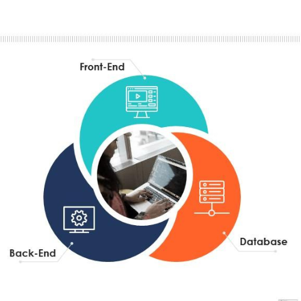
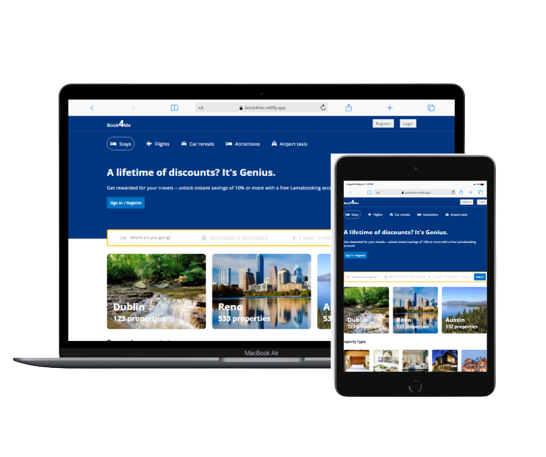

## 

**─**

Marvelous Obiji

[[marvelousobiji@gmail.com]](mailto:marvelousobiji@gmail.com)

[[https://github.com/Bz-codes]](https://github.com/Bz-codes)

09051775961

# Book4Me Booking Site Documentation

Welcome to the documentation for Book4Me, a booking site designed for
travelers who wish to book hotel rooms at specific locations. This
document provides an overview of the features, user access levels,
technologies used, and deployment details of the application.

View app;
[[https://book4me.netlify.app/]](https://book4me.netlify.app/)

## 

## 

## **Table of Contents**

-   Introduction

    -   Purpose

    -   Key Features

    -   User Access Levels

    > Technologies Used

    -   MERN Stack

    -   Third-Party Services

    > Authentication and Authorization

    -   Authenticated Users

    -   Unauthenticated Users

    > Features and User Interaction

    -   Searching for Hotels

    -   Viewing Hotel Details

    -   Room Booking Process

    -   Reviewing Services

    > API Endpoints

    -   Authentication Endpoints

    -   Hotel and Room Endpoints

    -   Booking and Review Endpoints

    > Deployment

    -   Frontend Deployment with Netlify

    -   Backend Deployment

    -   Database Setup

## **1. Introduction**

### **Purpose**

Book4Me is a web application that facilitates hotel room bookings for
travelers. It allows users to search for hotels, view hotel details,
book rooms, and review services provided by the hotels.

### **Key Features**

-   Hotel search and filtering by location, dates, and preferences.

-   Detailed information about each hotel, including amenities and room
    > options.

-   Secure user authentication and authorization system.

-   Booking rooms with confirmation and email notifications.

-   Reviewing and rating services of the hotels.

-   User profiles to manage bookings and reviews.

### **User Access Levels**

-   Authenticated Users: These users have signed up and logged in to the
    > application. They can access all features, including hotel booking
    > and service reviewing.

    > Unauthenticated Users: These users can browse available hotels and
    > view their details, but they cannot book rooms or leave reviews.

## **2. Technologies Used**

### **MERN Stack**

-   MongoDB: Database to store hotel, user, booking, and review data.

-   Express.js: Backend framework to handle routing and business logic.

-   React: Frontend library for building user interfaces.

-   Node.js: Server runtime environment for the backend.

### **Third-Party Services**

-   Postman: Used for testing API endpoints during development.

-   Netlify: Platform for deploying the frontend application.

-   Other Services: Integration with email services for notifications.

## **3. Authentication and Authorization**

### **Authenticated Users**

Authenticated users have access to all features, including room booking
and service reviewing. They can log in using their credentials, and
their actions are associated with their user profiles.

### **Unauthenticated Users**

Unauthenticated users can search for hotels and view their details.
However, they are not able to book rooms or leave reviews. To access
full functionality, they need to sign up and log in.

## **4. Features and User Interaction**

### **Searching for Hotels**

Users can search for hotels based on location, check-in and check-out
dates, and preferences such as room type and amenities.

### **Viewing Hotel Details**

Users can view detailed information about a particular hotel, including
available rooms, amenities, and prices.

### **Room Booking Process**

Authenticated users can select rooms, specify the number of guests, and
proceed to book. After booking, they receive confirmation and email
notifications.

### **Reviewing Services**

Authenticated users can leave reviews and ratings for hotels and
services they have experienced.

## **5. API Endpoints**

### **Authentication Endpoints**

-   POST /api/auth/signup: Create a new user account.

-   POST /api/auth/login: Log in an existing user.

### **Hotel and Room Endpoints**

-   GET /api/hotels: Retrieve a list of hotels based on search
    > parameters.

-   GET /api/hotels/:hotelId: Get detailed information about a specific
    > hotel.

-   GET /api/hotels/:hotelId/rooms: Get available room options for a
    > specific hotel.

### **Booking and Review Endpoints**

-   POST /api/bookings: Book a room with specified details.

-   POST /api/reviews/:hotelId: Leave a review for a specific hotel.

## **6. Deployment**

### **Frontend Deployment with Netlify**

The frontend application is deployed on Netlify. Any changes to the
frontend code in the repository trigger automatic deployment.

### **Backend Deployment**

The backend server is hosted on a cloud platform, AWS. Environment variables are securely stored for
configuration.

### **Database Setup**

MongoDB is used as the database for the application. The database is
configured based on the cloud hosting provider\'s recommendations.
